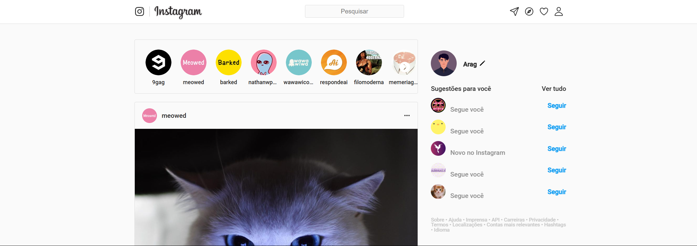
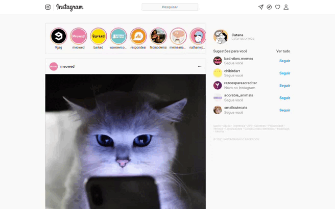

# 
Instagram

### 
Tecnologias utilizadas:

   
   
   
  

## 📖 Descrição
Nesse projeto fizemos um aplicativo clone da rede social Instagram. O desenvolvimento envolveu várias etapas e a integração de diferentes tecnologias como HTML5, CSS3, JavaScript e React. Nele é possível visualizar os posts disponíveis no feed do usuário, curtir posts e comentários.

## 📋 Pré-requisitos
Para desenvolver um projeto completo de uma rede social como o Instagram são necessárias as seguintes habilidades:

• HTML e CSS

    Domínio de conceitos de estruturação de páginas HTML.
    Conhecimento em CSS Flexbox e Grid para layout responsivo.
    Capacidade de usar pré-processadores como SASS (opcional).

• JavaScript (ES6+)

    Manipulação de arrays e objetos (e.g., map, filter, reduce).
    Uso de promises e async/await para requisições assíncronas.
    Conhecimento básico sobre APIs REST.

• React.js

    Compreensão de componentes funcionais e props.
    Uso de useState e useEffect para gerenciamento de estado e ciclo de vida.
    Integração com React Router para navegação entre páginas.

• Design Responsivo

    Familiaridade com media queries para adaptar o layout a diferentes tamanhos de tela (mobile-first).

• Noções Básicas de Backend (opcional inicialmente)

    Uso de Firebase ou criação de um backend simples com Node.js e Express.js.
    Conhecimento em armazenamento de dados no formato JSON.

## 🚀 Instalação
Baixe o repositório do projeto no github e execute em sua máquina. Ou, se preferir, acesse o aplicativo online no link abaixo:

💬 [**Acesse aqui**](https://instagram-clone-react-sigma.vercel.app/)

## 💻 Preview

## 🎮 Usando

$~$

[🔝 De volta ao topo](#bate-papo-uol)

